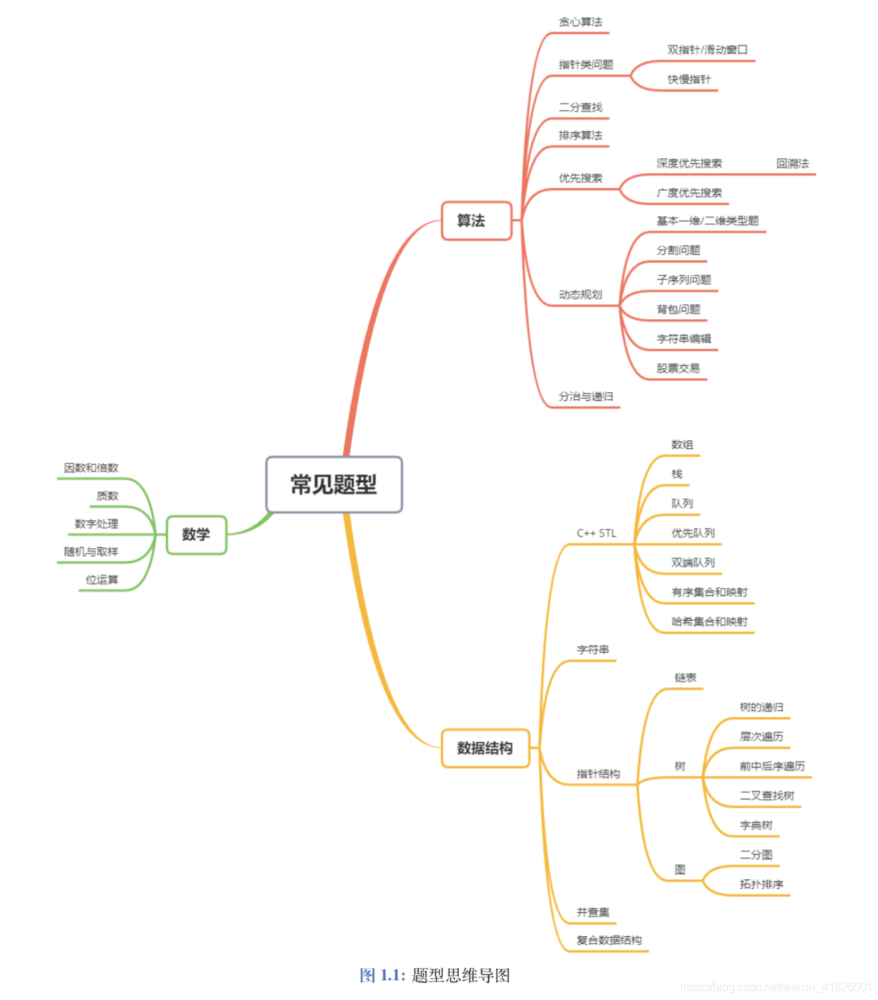

算法题

要先选数据结构，如哈希表等

数据结构本身便是存储和操作数据的集合

代码要具有扩展性

# 算法刷题分类大纲

## 基础

### STL的基础使用

### 排序

### 进制转换与位运算

### 高精度

### 模拟

### 数学问题

### 贪心算法

### 枚举

### 递推与递归

### 二分答案

### 深度优先搜索

### 广度优先搜索

### 动态规划基础

### 背包问题

