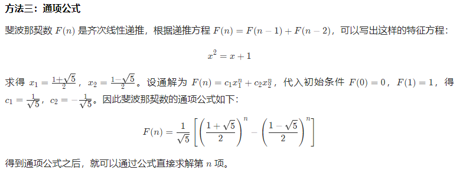

动态规划

用于解决多阶段决策最优化问题

（请与递归进行比较）

对阶段决策过程满足最优性原理：在多阶段决策过程中，各子问题的解只与其前面的子问题的解相关，而且各子问题的解都是相对于当前状态的最优解，整个问题的最优解是由各个子问题的最优解构成。

动态规划要满足最优化原理和无后效性

存在型动态规划 boolean数组

最值型动态数组：

计数型动态数组：

子问题子问题子问题子问题

动态规划解题流程

分解子问题，确定状态，开dp[]：注重看最后一步及中间状态

状态转移方程：

初始条件和边界情况：小于0，等于0，大于0

求解dp数组

注意加值！！！！

返回值f[m-1][n-1]

动态规划类型

一坐标型动态规划(20%)
一序列型动态规划(20%)
一划分型动态规划(20%)
一区间型动态规划(15%)
一背包型动态规划(10%)
一最长序列型动态规划(5%)
一博弈型动态规划(5%)
一综合性动态规划(5%)

动态规划题目特点

1.计数
-有多少种方式走到右下角
-有多少种方法选出k个数使得和是Sum
2.求最大最小值
-从左上角走到右下角路径的最大数字和
-最长上升子序列长度
3.求存在性
-取石子游戏,先手是否必胜
-能不能选出k个数使得和是Sum

相应问题

669

数塔问题

斐波那契数列

图-最短路径

图-TSP

0/1背包问题

组合-最长递增子序列

组合-最长公共子序列

查找-最优二叉查找树

查找-近似串匹配问题

斐波那契数列

